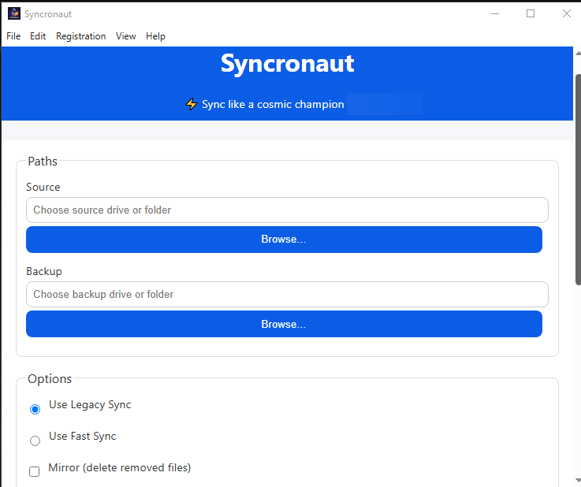
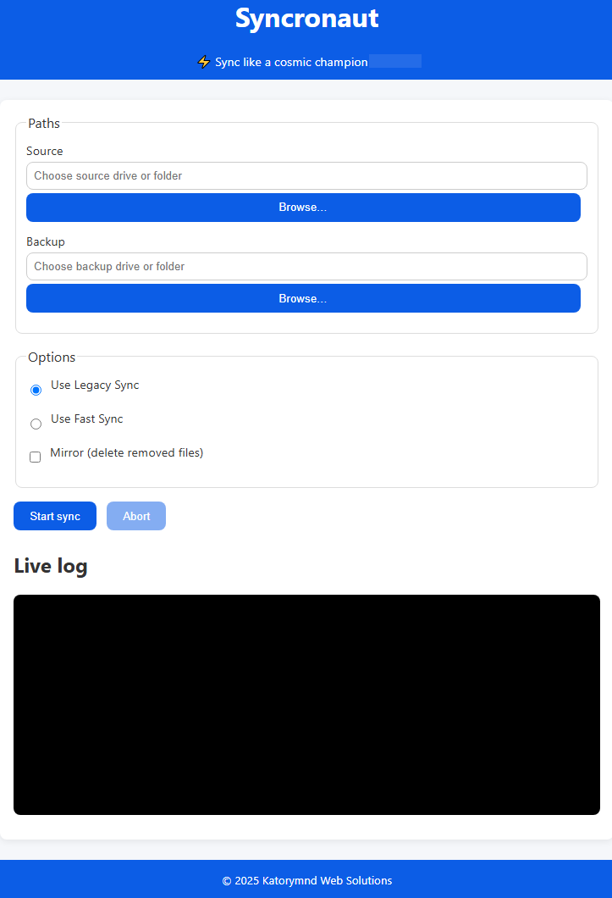

# Syncronaut

🚀 **Syncronaut** is a fast, reliable backup and sync tool for Windows (with optional Linux/WSL support).  
It specializes in **mirror backups**, **auditable logs**, and **surgical precision** for professional workflows.

---

## ✨ Features
- Fast **mirror updates** for large folder trees
- Windows-first with PowerShell helpers
- Optional **WSL rsync** support for Linux-style precision (coming soon)
- Portable and installer builds available
- Friendly, verbose logging with progress indicators
- Command Line Interface (CLI) for automation & CI/CD
- **No telemetry** — local-first and transparent

---

## 📥 Download

Get the latest builds from the [official Syncronaut Downloads page](https://katorymnd.com/syncronaut/) or from  
[GitHub Releases](https://github.com/katorymnd/syncronaut/releases).

- **Installer** → Easy setup with shortcuts  
- **Portable** → Run anywhere, no install needed  

After download, verify integrity with [Verify Downloads](docs/verify-downloads.md).

---

## ⚡ Quickstart

1. Install Syncronaut (or run portable build).  
2. Select **Source** and **Destination** folders.  
3. Choose mode:
   - `Update` → copy new/changed files only  
   - `Mirror` → exact replica, delete extras at destination  
4. Click **Start** and watch logs for progress.  

Prefer automation? Use the [CLI](docs/interface.md#command-line).

---

## 🖥️ Screenshots

Main dashboard:  


Menu bar & options:  


---

## ⚙️ Configuration

- Config files are stored in:
```

C:\Users\<YOU>\AppData\Roaming\syncronaut\\

```
- Contains `config.json`, logs, and license info.  
- Works seamlessly across both **portable** and **installer** editions.  

More details in [Configuration Docs](docs/config.md).

---

## 🛠️ Built-in Scripts

- **WSL rsync** wrapper for Linux-style syncing  
- **Robocopy** fast update scripts for Windows  
- **Verify-Downloads.ps1** script for SHA256 integrity checks  


---

## 📚 Documentation

The full documentation is maintained separately under [docs](docs/index.md). 

---

## 🔒 Security

- Local-first, no network ports opened  
- Transparent logs with no secrets stored  
- All downloads published with SHA256 checksums  

See [Security](docs/security.md).

---

## ⚖️ License

- **Application** → Proprietary, © 2025 Katorymnd Web Solutions  
- **Documentation** → MIT License ([docs/license.md](docs/license.md))  

---

> ✨ Syncronaut: practical, reliable, surgical backups for Windows and beyond.

